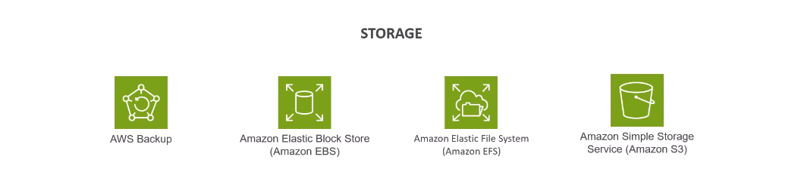

# AWS Services

- **Analytics** 
    - Amazon EMR (Elastic MapReduce)
    - AWS Lake Formation
    - Amazon Redshift
    - Amazon Kinesis
    - Amazon Managed Streaming for Apache Kafka
    - AWS Glue
    - Amazon OpenSearch Service
    - Amazon QuickSight
    - Amazon Athena
- **App Integration**
    - Amazon EventBridge
    - Amazon Step Functions
    - Amazon AppFlow
    - Amazon SNS (Simple Notification Service)
    - Amazon SQS (Simple Queue Service)
    - Amazon Managed Workflows for Apache Airflow
- **Cloud Financial Management**
    - AWS Budgets
    - AWS Cost Explorer
- **Compute**
    - AWS EC2 (Elastic Compute Cloud)
    - AWS Batch
    - AWS Lambda
    - AWS Serverless Application Repository
- **Containers**
    - Amazon ECR (Elastic Container Registry)
    - Amazon ECS (Elastic Container Service)
    - Amazon EKS (Elastic Kubernetes Service)
- **Database**
    - Amazon DocumentDB (with MondoDB compatibility)
    - Amazon DynamoDB
    - Amazon Keyspaces (for Apache Cassandra)
    - Amazon MemoryDB for Redis
    - Amazon Neptune
    - Amazon RDS (Relational Database Service)
- **Developer Tools**
    - AWS Command Line Interface (CLI)
    - AWS Cloud9
    - AWS CDK (Cloud Development Kit)
    - AWS CodeBuild
    - AWS CodeCommit
    - AWS CodeDeploy
    - AWS CodePipeline
- **Frontend Web**
    - Amazon API Gateway
- **Machine Learning**
    - Amazon SageMaker
- **Management and Governance**
    - AWS CloudFormation
    - AWS CloudTrail
    - Amazon CloudWatch
    - AWS Config
    - Amazon Managed Grafana
    - AWS Systems Managers
    - AWS Well-Architected Tool
- **Migration and Transfer**
    - AWS Application Discovery Service
    - AWS Application Migration Service
    - AWS Database Migration Service
    - AWS DataSync
    - AWS Transfer Family
    - AWS Snow Family
- **Networking and Content Delivery**
    - Amazon CloudFront
    - AWS PrivateLink
    - Amazon Route 53
    - Amazon VPC (Virtual Private Cloud)
- **Security, Identity, and Compliance**
    - AWS IAM (Identity and Access Management)
    - AWS KMS (Key Management Service)
    - Amazon Macie
    - Amazon Secrets Manager
    - AWS Shield
    - AWS WAF (Web Application Firewall)
- **Storage**
    - Amazon S3 (Simple Storage Service)
    - Amazon EBS (Elastic Block Store)
    - Amazon EFS (Elastic File System)
    - Amazon Backup
    

## AWS Data Engineering Services Overview

